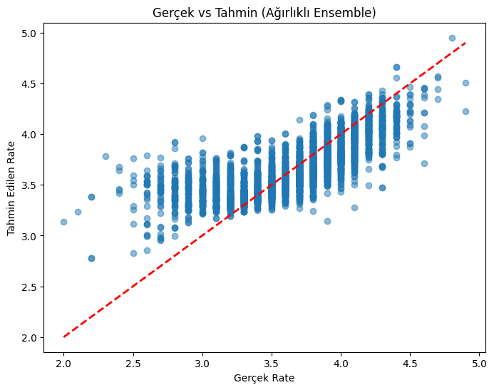
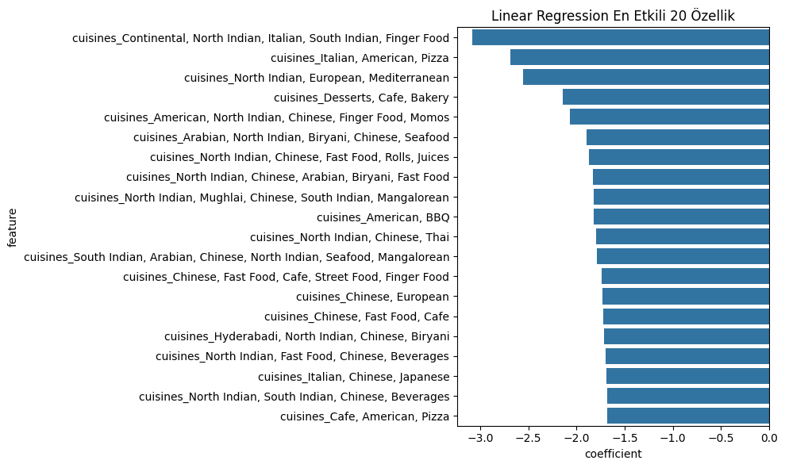
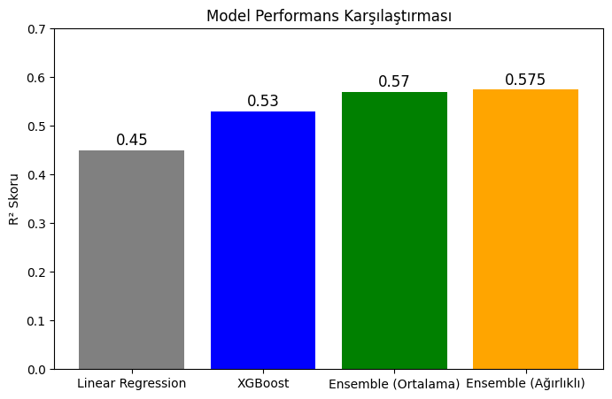
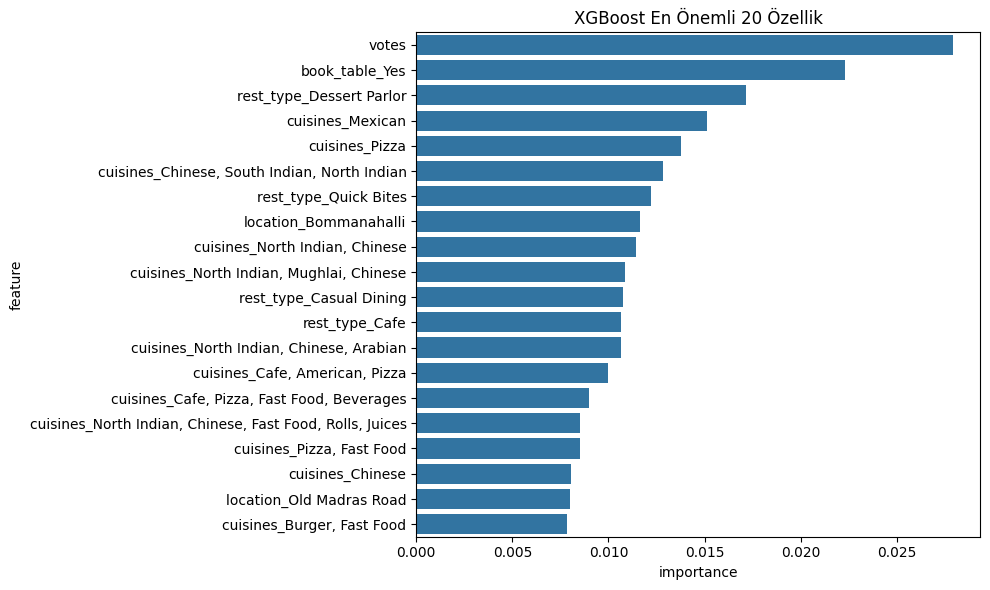

# restaurant-rating-prediction
A machine learning project using real-world Zomato data to predict restaurant customer ratings with Python, XGBoost, Linear Regression, and ensemble modeling. Includes feature analysis, model comparison, and business insights.
# 🍽️ Restaurant Customer Rating Prediction Project

A machine learning project to predict restaurant customer ratings using Python and Google Colab. This project explores the impact of key business features and applies multiple regression models to forecast customer satisfaction.

---

## 📊 Project Overview

This project aims to predict restaurant ratings more accurately by analyzing various features such as:
- Number of votes
- Online order availability
- Table booking option
- Restaurant type, location, and cuisine
- Cost for two people
- Listing category (e.g., Buffet, Delivery)

With proper feature engineering and ensemble modeling, the goal is to help businesses make smarter decisions based on data-driven insights.

---

## 🧠 ML Techniques Used

- Data Cleaning & Preprocessing
- One-Hot Encoding for Categorical Features
- Multiple Linear Regression
- XGBoost Regressor
- Weighted Ensemble Modeling (e.g., 30% Linear + 70% XGBoost)
- Feature Importance Analysis

---

## 📈 Rating Distribution

Distribution of customer ratings in the dataset:

*Figure 1: Most restaurants are rated between 3.0 and 4.5.*

---

## 📌 Correlation Heatmap

Understanding how features relate to each other and to the target variable:

*Figure 2: Votes and average cost show meaningful correlations with the rating.*

---

## ⚖️ Model Performance Comparison

Model performances were evaluated using R² and RMSE metrics:

| Model               | R² Score | RMSE   |
|---------------------|----------|--------|
| Linear Regression   | 0.45     | 0.31   |
| XGBoost             | 0.53     | 0.28   |
| Weighted Ensemble   | **0.57** | **0.27** |

*Figure 3: The ensemble model achieved the best accuracy.*

---

## 🔍 Feature Importance

Top features impacting customer ratings:

*Figure 4: Votes and online order availability are key drivers.*

| Feature            | Relative Impact (%) |
|--------------------|---------------------|
| Votes              | 35%                 |
| Online Order       | 20%                 |
| Average Cost       | 15%                 |
| Restaurant Type    | 10%                 |
| Location           | 10%                 |
| Menu Variety       | 5%                  |
| Other Factors      | 5%                  |

---

## 🎯 Business Insights

From a data scientist's perspective, this model can support businesses in the following ways:

- 🎯 Focus marketing on key drivers like online ordering and ratings
- 📍 Optimize service and pricing strategy based on location and cost insights
- 💡 Allocate resources to areas with the biggest impact on customer satisfaction
- 🔍 Track and benchmark competitors in similar categories

---

## 🛠️ Tools & Technologies

- Python (pandas, NumPy, scikit-learn, XGBoost, seaborn, matplotlib)
- Google Colab
- Git & GitHub

---

## 🚀 Run the Notebook

1. Clone this repository or open in Google Colab
2. Upload the dataset: `zomato.csv`
3. Run the `notebook.ipynb` step-by-step

---

## 📁 Files

- `notebook.ipynb` → Full ML pipeline with visualizations
- `restaurant-rating-prediction/` → Images used in this README
- `README.md` → This documentation

---

## 🤝 Contact

Feel free to connect on [LinkedIn](https://www.linkedin.com/in/tuğba-bayar-100811151?lipi=urn%3Ali%3Apage%3Ad_flagship3_profile_view_base_contact_details%3BxRUzNC3SRBuMdWT9PaXPhg%3D%3D) or open an issue for feedback or collaboration.
